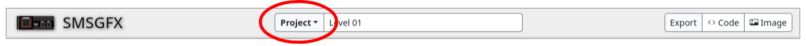
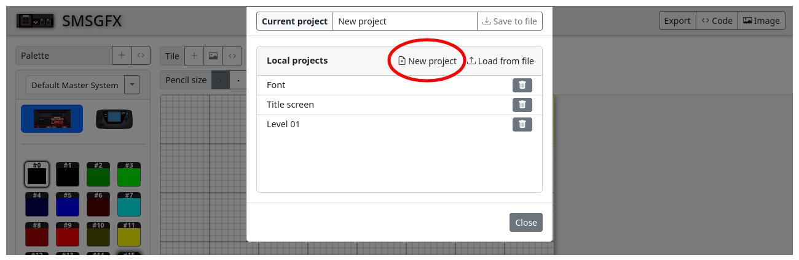
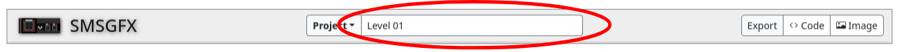

# How-to
## Create a new blank project

1. Click the [**Project**] menu.

1. Click on the [**New project**] button.

1. You should now have a new project.

### Optional tasks
#### Name your project
1. Click in the [**Project name**] textbox on the project toolbar.

1. Modify the value in the textbox. 
1. The project name will be automatically updated, no need to save.