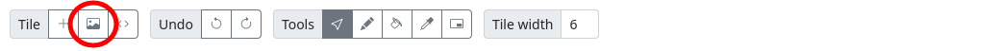

# How-to
## Import an image as a new project

This document refers to how to import a regular bitmap image into SMSGFX so that you may work with it.

### Load an image via the toolbar button
1. On the [Tile editor toolbar] click the [**Import image**] toolbar button.

1. In the **Import image** dialogue click on the [**Load image from file**] button.

1. In the file browser window select the valid image file that you would like to load, the image will be loaded into the window.
1. Continue to the "**Format your image**" section for details on how to format your image for import.

### Import an image via copy and paste 
1. In any application that supports it, copy an image to the system clipboard.
1. Switch back to the SMSGFX window and paste the image into the window (example [Ctrl] + [V] on PC or [⌘] + [V] on Mac).
1. The image data type in the clipboard will be detected, the **Import image** dialogue will appear and the image will be loaded into the window. 
1. Continue to the "**Format your image**" section for details on how to format your image for import.

### Format your image

#### Choose your palette
Use the '**Palette**' drop down to select the palette that you would like to create from the image, your options are:
1. **Create new Master System palette** - the application will import this image with a 16 colour Master System compatible palette. The Master System has a palette of 64 possible colours.
1. **Create new Game Gear palette** - the application will import this image with a 16 colour Game Gear compatible palette. The Game Gear has a palette of 4096 possible colours.
1. **Other palettes** - any palettes that you've already defined in the project will appear in the list, when you select one of these palettes, the application will attempt to match the colours in the image to the closest colour in the selected palette.

#### Change the image size
By default, to increase performance your image size will be limited to a maximum or 256 x 256 pixels, however you can manually set the size of the imported image to be larger or smaller. 

* Toggle '**Lock aspect ratio**' if you do not want to maintain the original aspect ratio of the image. 
* You can modify the width and height fields in either a pixel size or a percentage of original. 
* There is a revert button if you would like to reset the image scale.

#### Change the tile origin
This setting adjusts the X and Y offset from the top left of the image where the tile map will begin.

By default this setting is hidden, you will need to click the reveal icon to the right of the '**Tile origin**' heading.

You can set a positive of negative value here. 
Any pixels outside the image will be rendered as white.

#### Change the number of tiles
By default the application will create enough tiles to cover the width and height of the image, combine this with the 'Tile origin' feature to import a part of an image. 

Tiles are added from the X and Y coordinates in the 'Tile origin' feature. 

By default this setting is hidden, you will need to click the reveal icon to the right of the '**Number of tiles**' heading.

### Importing tiles
When you are done, you have the option to import the image as a new project, or you may append the tiles to the existing project. 

* [**Import as new project**] - this button will import the image as an entirely new project. 
* [**Import into existing project**] - this button will append the newly created tiles to the existing project.