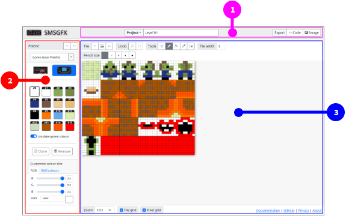

# Interface

## Interface tour

### Main interface 

The SMSGFX interface can be split into three main areas:

1. Project toolbar.
1. Palette editor.
1. Tile editor.

These areas can be further divided as below.

#### Project toolbar