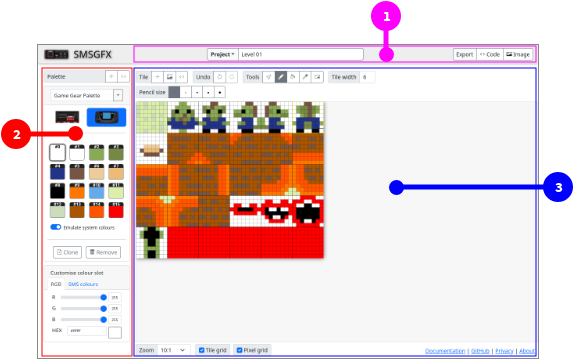
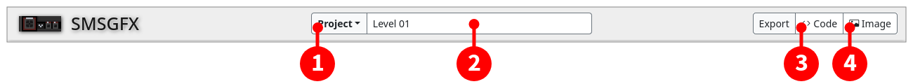
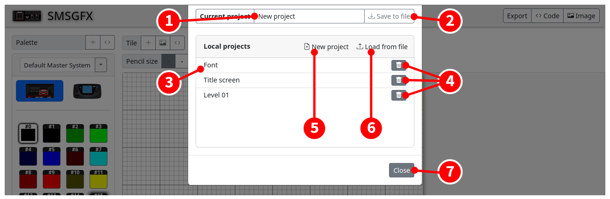
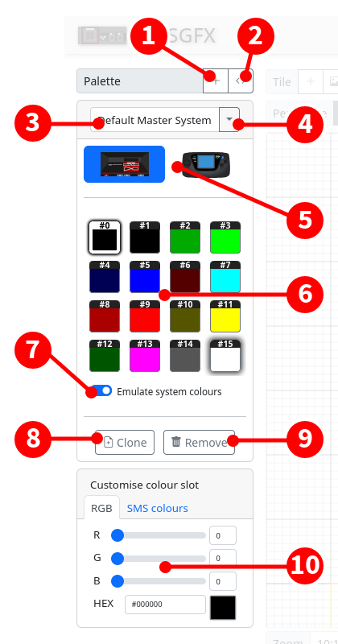
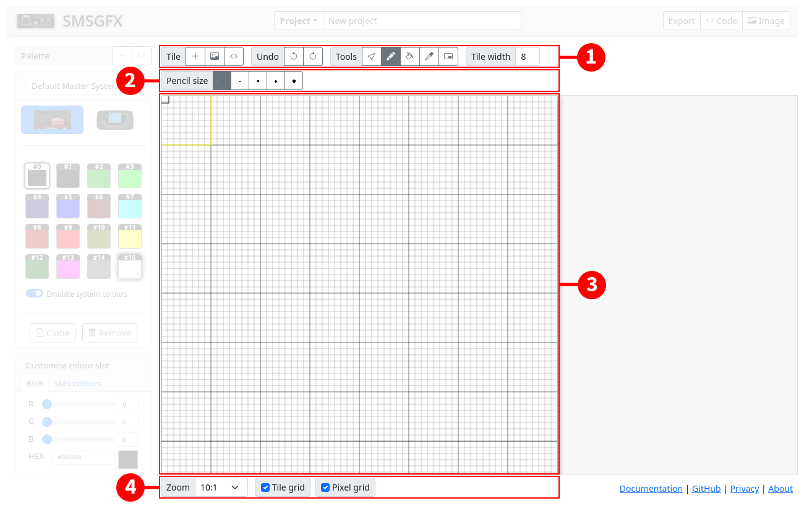
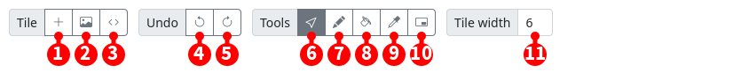
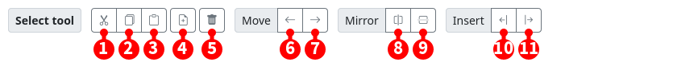
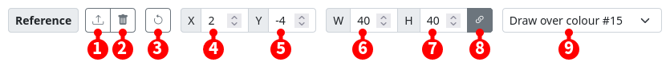
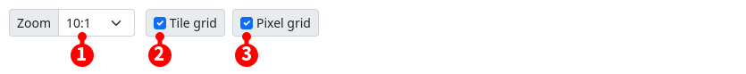

# Interface

## Interface tour

### Main interface 

The SMSGFX interface can be split into three main areas:

1. **Project toolbar** - Manage your projects, import and export files.
1. **Palette editor** - Create and manage colour palettes.
1. **Tile editor** - Create and edit your graphics tiles.

These areas can be further divided as below.

### Project toolbar

The project toolbar allows you to manage your projects, load and save project files, export code and image previews.

1. Show the **project menu** (see below).
2. **Project name** - Displays the project name, click and type in this field to change the project name.
3. **Export code** - Converts the entire project to assembly code and displays it in a window so that you can download it.
3. **Export image** - Download the displayed tile set as a PNG image.

The project menu is where you manage your loaded projects.

1. **Project name** - Displays the project name, click and type in this field to change the project name.
2. Save the current project as a JSON file.
3. **Project list** - Shows all of the projects that are in browser memory, click the title of a project to load it instantly.
4. Remove/delete a project from browser memory (this can not be undone, please save your project as JSON first!).
5. Create a new project in browser memory, the newly created project is loaded instantly.
6. Load a project from a previously exported JSON file.
7. Click the project menu (you can also click outside the project menu or press the `ESC` key.)

### Palette editor

The palette editor is where you create and manage your colour palettes.

1. Add a new palette with default colours and system selection.
2. Import a colour palette from assembly code.
3. Palette friendly name, click and type into this field to edit.
4. Palette selector drop-down.
5. System selection, choose between Sega Master System and Game Gear. Changing this option will affect the exported palette code and also how colours appear in the tile editor.
6. Palette colour slots.
     - Single click a colour slot to select that colour. 
     - Double click a colour slot to display the colour editor window.
     - Currently selected colour is highlighted with a dark outline. 
     - As you move the mouse over the tile editor, the colour index that appears underneath the cursor is given a lighter outline.
7. Enable "Emulate system colours" if you would like to snap colour display to the closest compatible colour for the given system, otherwise the colour will be rendered in the exact R, G, B values you entered.
8. Clones the currently displayed palette as a new palette.
9. Removes/deletes the currently displayed colour palette.
10. With a colour selected, you can adjust the values here to modify the selected colour index, or click the "SMS colours" tab to pick from the entire SMS palette of 64 colours.

### Tile editor

The tile editor is where you create and draw your tiles, the editor itself can be split into several sections as below:

1. **Main toolbar** - Access higher level application functions.
2. **Context toolbar** - Displays contextual functions relating to the selected tool on the main toolbar.
3. **Pixel editor** - graphical editor for previewing and modifying your tiles.
4. **View toolbar** - control zoom level, and other display settings.

Each of these areas are explained below.

#### Main toolbar

1. **New tile** - Adds a new tile to the end of the tileset.
2. **Import image** - Displays the image import dialogue allowing you to select a file form your local hard drive and convert it to a tile set.
3. **Load tiles from code** - Displays a dialogue that allows you to import tiles from assembly code.
4. **Undo** - Where available, undo your last action.
5. **Redo** - Where available, redo an action that was previously undone.
6. **Select tool** - Allows you to select individual tiles to perform various functions such as delete, copy, paste, mirror, etc.
7. **Pencil tool** - Draw onto tiles within the tile editor.
8. **Fill tool** - Fills/replaces a contigious area of one colour index with another colour index.
9. **Colour select tool** - Select the colour index associated with a pixel on the tile editor.
10. **Reference image tool** - Used to set a background reference image to be displayed within the viewport.
11. **Tile width** - When in tile set mode, changes the amount of tiles that are rendered per row in the viewport.

#### Context toolbar

##### Select tool

When the select tool is activated you can click to select individual tiles in the tile set and then perform various operations on the selected tile.

1. **Cut** - Copies the selected tile to the clipboard and then removes it from the tile set.
2. **Copy** - Copy the selected tile to the clipboard.
3. **Paste** - If a tile is in the clipboard it will be inserted into the tile set at the location of the selected tile, if no tile is selected it will be appended to the end of the tile set.
4. **Clone tile** - Creates a copy of the selected tile and then inserts the cloned tile adjacent to the selected tile.
5. **Delete tile** - Removes the selected tile from the tile set.
6. **Move tile left** - Swaps the index of the selected tile with the tile that comes before it.
6. **Move tile right** - Swaps the index of the selected tile with the tile that comes after it.
6. **Horizontal mirror** - Horizontally flips the content of the selected tile.
6. **Vertical mirror** - Vertically flips the content of the selected tile.
6. **Insert before** - Inserts a new blank tile before the selected tile.
6. **Insert after** - Inserts a new blank tile after the selected tile.

##### Pencil tool

Displayed when the pencil tool is activated.

1. **Brush size** - Allows you to choose a brush size.

##### Reference tool

Displayed when the reference image tool is activated.

1. **Select reference image** - Displays a file chooser that allows you to choose a reference image to display in the tile editor viewport.
2. **Remove reference image** - Removes the reference image from the viewport.
3. **Revert reference image** - Resets the attributes of the reference image.
4. **X position** - Change the horizontal position of the reference image.
5. **Y position** - Change the vertical position of the reference image.
6. **Image width** - Make the reference image horizontally wider or narrower.
7. **Image height** - Make the reference image vertically taller or shorter.
8. **Maintain aspect ratio** - When resizing the reference image enabling this option will maintain the horizontal or vertical proportions of the reference image.
9. **Display style** - Choose the way in which the reference image is displayed, it can be drawn in-place of a colour, or overlayed over the entire image.

### View toolbar

1. **Zoom level** - Change the size of the image displayed in the viewport.
2. **Show tile grid** - When enabled a border will be drawn around each 8x8 pixel tile.
3. **Show pixel grid** - When enabled a border will be drawn around each individual pixel.
